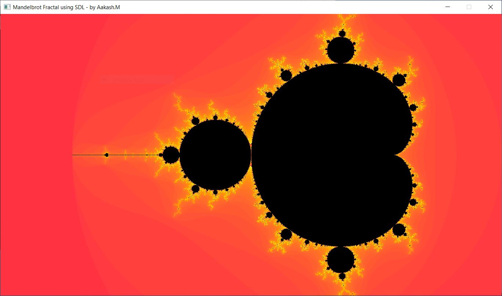
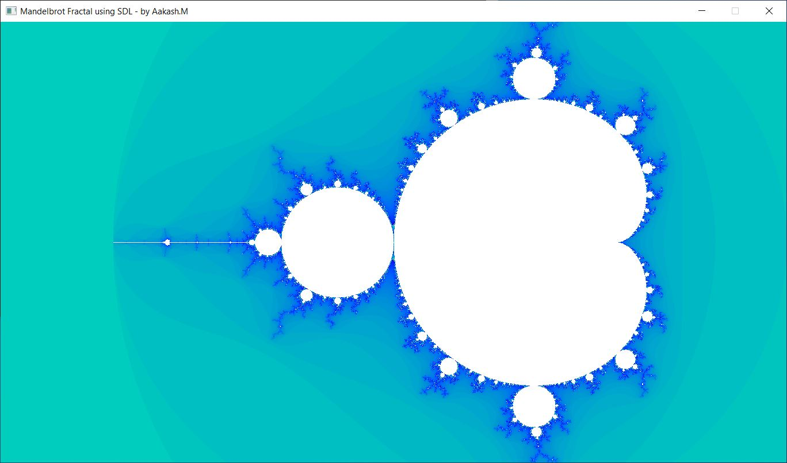
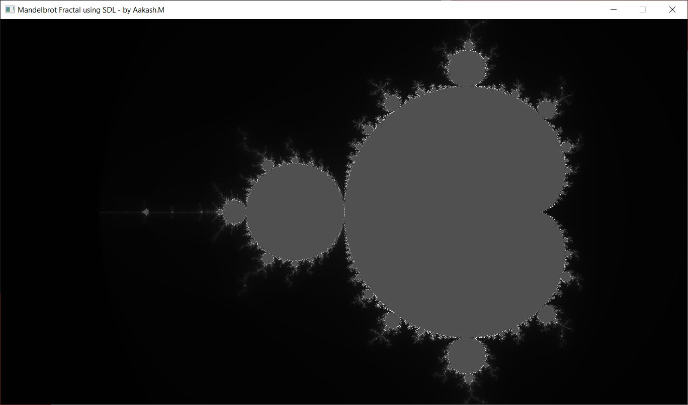
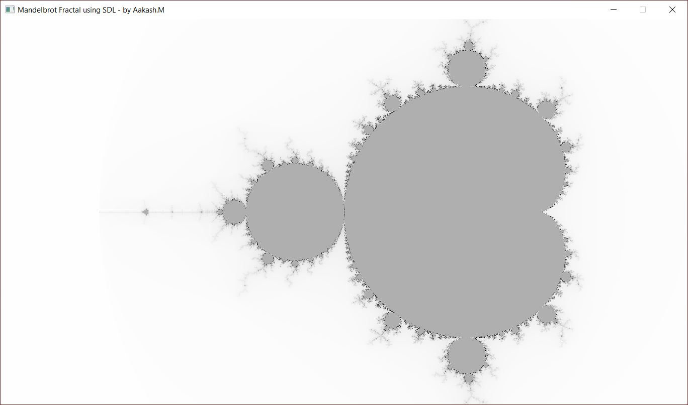

# MandelbrotSDL

The mandelbrot fractal is implemented in C using a powerful open-source 2D graphics library called SDL - Simple DirectMedia Layer (https://www.libsdl.org/). This project is to learn about the implementation of a mandelbrot fractal program using SDL library using the C programmming language. The color invertion is provided as a user preference within the program which can be changed during runtime to invert the colors before displaying the fractal.

  Mandelbrot Fractal | 4 Colors | 50000 iterations | 1366x768 resolution  </img>

  Mandelbrot Fractal | 4 Colors [Inverted] | 50000 iterations | 1366x768 resolution  </img>

  Mandelbrot Fractal | 1 Color | 50000 iterations | 1366x768 resolution  </img>

  Mandelbrot Fractal | 1 Color  [Inverted] | 50000 iterations | 1366x768 resolution  </img>

# Algorithm
    for each pixel (Px, Py) on the screen do
        x0 := scaled x coordinate of pixel (scaled to lie in the Mandelbrot X scale (-2.5, 1))
        y0 := scaled y coordinate of pixel (scaled to lie in the Mandelbrot Y scale (-1, 1))
        x := 0.0
        y := 0.0
        iteration := 0
        max_iteration := 1000
        while (x*x + y*y ≤ 2*2 AND iteration < max_iteration) do
            xtemp := x*x - y*y + x0
            y := 2*x*y + y0
            x := xtemp
            iteration := iteration + 1
    
    color := palette[iteration]
    plot(Px, Py, color)

Source: https://en.wikipedia.org/wiki/Mandelbrot_set

# Build Instructions

 1. Download the Windows SDL development libraries (Visual C++ libraries) from https://www.libsdl.org/download-2.0.php, extract the zip file to the same directory where the source files are present.
 3. Configure the SDL include directories and library directories for the compiler and linker in Visual Studio 2019.
 4. Switch to Release configuration and build the project.

## Downloads:
The compiled binaries are provided in bin folder. 

32-bit binary and DLL for Windows: [Download](https://github.com/aakashm101/MandelbrotSDL/tree/main/bin/x86)

64-bit binary and DLL for Windows: [Download](https://github.com/aakashm101/MandelbrotSDL/tree/main/bin/x64)